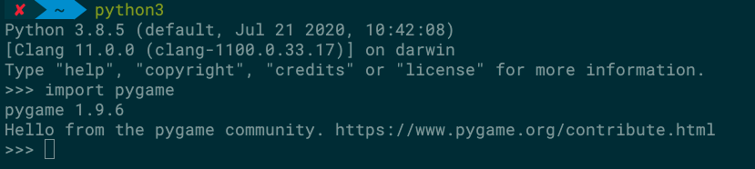

### MAC 安装pip报错
urllib3.exceptions.ReadTimeoutError: HTTPSConnectionPool(host='files.pythonhosted.org', port=443): Read timed out

#### 解决办法：
1.在~目录下新建文件夹.pip  mkdir ~/.pip
2.新建配置文件 pip.conf
3.在pip.conf里配置国内源

```
[global]
index-url = http://pypi.douban.com/simple
trusted-host = pypi.douban.com           disable-pip-version-check = true
timeout = 120
```


### Mac 安装Pygame

* 安装Pygame依赖的库
  ```
  brew install hg sdl sdl_image sdl_ttf
  ```
* 如果你还想启用较高级的功能，如在游戏中包含声音，可安装下面两个额外的库：
  
  ```
  brew install sdl_mixer portmidi
  ``` 
* 安装Pygame
  ```
  pip3 install pygame
  ```
* 验证是否安装成功
  ```
  启动python终端
  输入import pygame
  ```
  


